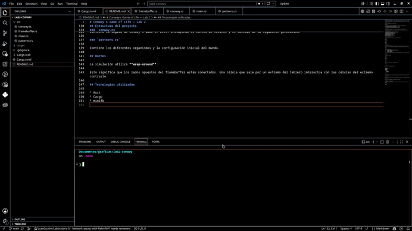

# Conway's Game of Life — Lab 2

Implementación de **Conway's Game of Life** desarrollada en **Rust** para el Laboratorio 2 del curso de Gráficas por Computadora.

El proyecto implementa una simulación en tiempo real utilizando un framebuffer propio, donde cada píxel representa una célula del Game of Life.

## Conway's Game of Life

Cada célula puede encontrarse en uno de dos estados:

* **Viva**
* **Muerta**

En cada generación, el estado de una célula depende de sus 8 vecinos y de las siguientes reglas:

1. Una célula viva con menos de 2 vecinos vivos muere por subpoblación.
2. Una célula viva con 2 o 3 vecinos vivos sobrevive.
3. Una célula viva con más de 3 vecinos vivos muere por sobrepoblación.
4. Una célula muerta con exactamente 3 vecinos vivos vuelve a vivir.

## Implementación

El programa utiliza un framebuffer de **100 × 100 píxeles**, donde cada píxel representa una célula.

El framebuffer se muestra escalado en una ventana para poder observar claramente la evolución de las células.

La implementación incluye:

* Función `point()` para dibujar píxeles en el framebuffer.
* Función `get_color()` para consultar el estado de una célula.
* Conteo de los 8 vecinos de cada célula.
* Implementación de las cuatro reglas de Conway.
* Cálculo independiente de cada nueva generación.
* Animación en tiempo real.
* Control de velocidad de la simulación.
* Sistema de wrap-around en los bordes.
* Diferentes patrones clásicos del Game of Life.
* Reinicio de la simulación.
* Pausa y avance manual de generaciones.

## Patrones implementados

La configuración inicial contiene diferentes tipos de organismos clásicos.

### Still Lifes

* Block
* Beehive

### Oscillators

* Blinker
* Toad
* Beacon
* Pulsar

### Spaceships

* Glider
* Lightweight Spaceship (LWSS)

La configuración inicial utiliza múltiples instancias de estos organismos distribuidas por el framebuffer.

Durante la simulación, los organismos pueden interactuar y colisionar, generando nuevos patrones de acuerdo exclusivamente con las reglas de Conway's Game of Life.

## Controles

| Tecla   | Acción                                       |
| ------- | -------------------------------------------- |
| `SPACE` | Pausar / continuar                           |
| `N`     | Avanzar una generación mientras está pausado |
| `R`     | Reiniciar la simulación                      |
| `↑`     | Aumentar la velocidad                        |
| `↓`     | Disminuir la velocidad                       |
| `ESC`   | Cerrar el programa                           |

El título de la ventana muestra la generación actual, el estado de la simulación y el tiempo entre generaciones.

## Ejecución

### Requisitos

Es necesario tener instalado:

* Rust
* Cargo

### Compilar

```bash
cargo build
```

### Ejecutar

```bash
cargo run
```

También se puede compilar y ejecutar directamente utilizando:

```bash
cargo run
```

## Demostración



## Estructura del proyecto

```text
lab2-conway/
├── Cargo.toml
├── README.md
├── assets/
│   └── conway.gif
└── src/
    ├── main.rs
    ├── framebuffer.rs
    ├── conway.rs
    └── patterns.rs
```

### `main.rs`

Contiene el game loop, creación de la ventana, controles de teclado, velocidad de simulación y contador de generaciones.

### `framebuffer.rs`

Implementa el framebuffer y las operaciones principales de renderizado, incluyendo `point()` y `get_color()`.

### `conway.rs`

Contiene la lógica de Conway's Game of Life, incluyendo el conteo de vecinos y el cálculo de la siguiente generación.

### `patterns.rs`

Contiene los diferentes organismos y la configuración inicial del mundo.

## Bordes

La simulación utiliza **wrap-around**.

Esto significa que los lados opuestos del framebuffer están conectados. Una célula que sale por un extremo del tablero interactúa con las células del extremo contrario.

## Tecnologías utilizadas

* Rust
* Cargo
* minifb
